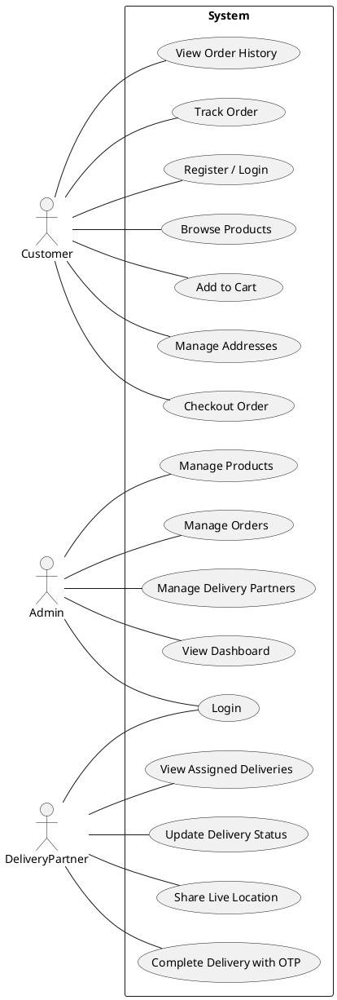
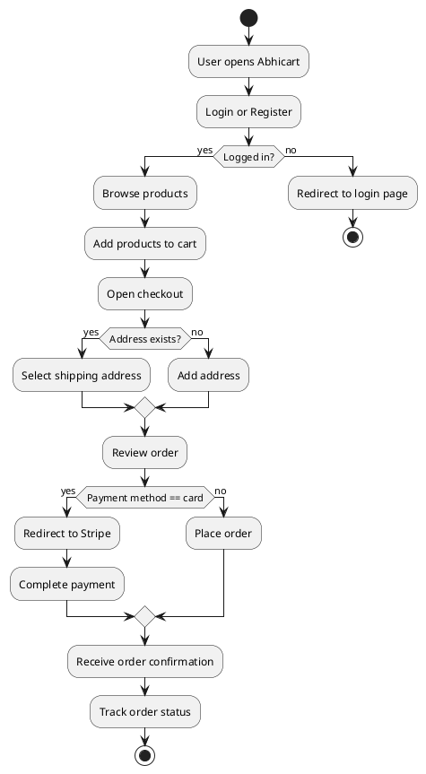
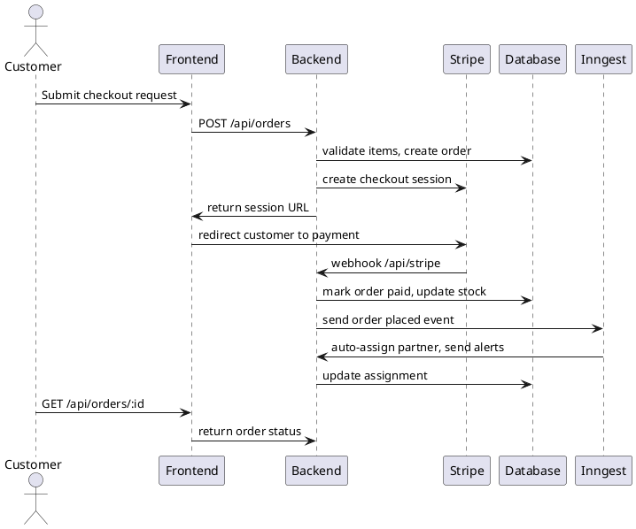
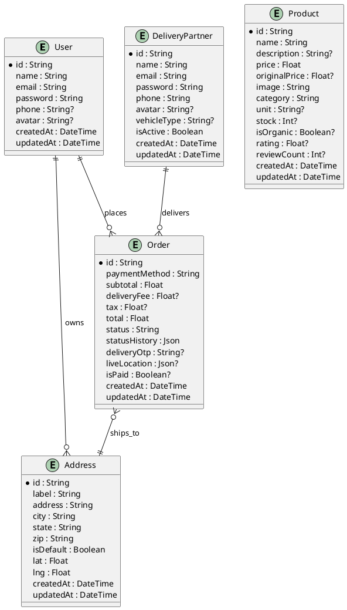

# Abhicart - Grocery Delivery Platform

## Cover Page

**Project Title:** Abhicart - Grocery Delivery Platform

**Submitted By:** Abhishek Kumar

**Degree:** Bachelor of Computer Applications / Master of Computer Applications

**Department:** Computer Science

**Institution:** [Your College / University Name]

**Guide:** [Supervisor Name]

**Date:** June 2026

---

## Certificate

This is to certify that the project titled **"Abhicart - Grocery Delivery Platform"** submitted by **Abhishek Kumar** in partial fulfillment of the requirements for the award of the degree of **BCA / MCA** is an original work carried out by him under my supervision.

**Project Guide:** _______________________________

**Head of Department:** ___________________________

**College Seal:** _________________________________

---

## Declaration

I hereby declare that the project report entitled **"Abhicart - Grocery Delivery Platform"** submitted to **[Institution Name]** is my own original work and has been carried out by me under the guidance of **[Supervisor Name]**. The work has not been submitted earlier, either in part or in full, to any other University or Institution for the award of any other degree.

**Name:** Abhishek Kumar

**Signature:** ______________________

**Date:** __________________________

---

## Acknowledgement

I express my sincere gratitude to my project guide **[Supervisor Name]** for their constant encouragement, technical guidance, and support throughout the development of this project. I would also like to thank the faculty members of the Computer Science Department for their valuable suggestions and encouragement.

My special thanks to my family and friends for their patience and motivation during the implementation of this platform.

---

## Abstract

The Abhicart Grocery Delivery Platform is a modern, full-stack web solution designed to enable online grocery shopping, order management, and delivery coordination. It integrates a React-based frontend with a Node.js and Express backend, using PostgreSQL managed by Prisma ORM for data persistence. The system supports role-based access with JWT authentication for customers, administrators, and delivery partners.

The platform offers product listing, search, category filtering, shopping cart management, checkout with Stripe payment integration, address management, order tracking, and delivery updates. The administrative interface enables product management, delivery partner management, order assignment, and system analytics. The delivery partner workflow supports login, active delivery tracking, location updates, status changes, OTP delivery confirmation, and cancellations.

The project also includes Cloudinary-powered image upload, Inngest-based background jobs for low stock alerts and auto-assigning delivery partners, and a responsive UI built with Tailwind CSS.

---

## Table of Contents

1. Cover Page
2. Certificate
3. Declaration
4. Acknowledgement
5. Abstract
6. Table of Contents
7. Introduction
8. Problem Statement
9. Objectives
10. Scope of the Project
11. Existing System
12. Proposed System
13. Requirement Analysis
    - Functional Requirements
    - Non-Functional Requirements
14. Software Requirements
15. Hardware Requirements
16. System Architecture
17. Project Workflow
18. Use Case Diagram (PlantUML code)
19. Activity Diagram (PlantUML code)
20. Sequence Diagram (PlantUML code)
21. ER Diagram (PlantUML code)
22. Database Design
    - All Tables
    - Fields
    - Relationships
23. Module Description
    - Authentication Module
    - Product Module
    - Cart Module
    - Order Module
    - Payment Module
    - Admin Module
    - Delivery Partner Module
24. API Documentation
25. Frontend Folder Structure
26. Backend Folder Structure
27. Prisma Schema Explanation
28. Authentication Flow
29. Stripe Payment Flow
30. Delivery Workflow
31. Screenshots Section
32. Testing
    - Unit Testing
    - Integration Testing
    - Test Cases Table
33. Advantages
34. Limitations
35. Future Enhancements
36. Conclusion
37. References
38. Glossary
39. Contributors

---

## 7. Introduction

Abhicart is a grocery delivery platform built to provide a complete shopping experience for customers, administrators, and delivery partners. The system combines a responsive React user interface with a robust Node.js and Express backend, backed by PostgreSQL and Prisma ORM.

The platform supports the entire grocery commerce lifecycle from browsing products to placing orders and monitoring delivery. It also includes administrative capabilities for managing inventory and delivery resources.

---

## 8. Problem Statement

Traditional brick-and-mortar grocery stores present inconvenience due to physical travel, time constraints, and limited product availability. Customers often face difficulty managing multiple addresses, tracking orders, and ensuring secure payment.

The problem addressed by Abhicart is the need for a digital solution that provides:

- Easy access to grocery catalogs
- Category-based search and product filtering
- Secure online checkout and payment
- Order tracking and delivery status updates
- Administrative control over product and delivery management

---

## 9. Objectives

The main objectives of the Abhicart project are:

1. Implement a user-friendly grocery shopping interface with product browsing and search.
2. Provide secure JWT-based authentication for customers, admins, and delivery partners.
3. Enable shopping cart and checkout workflows with address selection.
4. Integrate Stripe payment gateway for online payments.
5. Design an admin dashboard for product and order management.
6. Support delivery partner login, assignment, and live status tracking.
7. Build a responsive UI compatible with mobile and desktop.
8. Use background jobs for operational notifications and automation.

---

## 10. Scope of the Project

The scope of Abhicart includes:

- Customer registration and login
- Product listing with categories, search, and flash deals
- Cart management and checkout flow
- Address CRUD operations
- Order placement and order history
- Stripe payment integration for card transactions
- Order status and delivery tracking
- Admin management for products, orders, and delivery partners
- Delivery partner workflows with OTP and live location updates
- Cloudinary image uploads
- Inngest background jobs for stock monitoring and automation

Excluded from this initial scope are advanced analytics dashboards, multi-tenancy, and third-party marketplace integrations.

---

## 11. Existing System

Existing grocery ordering systems often provide limited features or require manual order processing. Common limitations include:

- Static product lists without administrative control
- Incomplete order tracking capabilities
- Weak or no support for delivery partner coordination
- Manual stock update workflows
- Poor user experience on mobile devices

---

## 12. Proposed System

Abhicart proposes a modern web-based grocery delivery system with:

- A customer-facing storefront with search and filtering
- Secure JWT authentication and session persistence
- Product management by admins with image uploads
- Automated stock alerting and delivery assignment
- Delivery partner monitoring and OTP completion
- A fully responsive UI for all stakeholders

This system provides stronger automation and more complete delivery lifecycle management than a traditional e-commerce system.

---

## 13. Requirement Analysis

### Functional Requirements

1. Customer registration and login.
2. Product browsing with category filtering.
3. Product detail page with information and add-to-cart.
4. Shopping cart persistence using browser storage.
5. Address addition, update, and deletion.
6. Checkout flow with order review and payment selection.
7. Stripe payment integration for card transactions.
8. Order creation and order history retrieval.
9. Order tracking by order status and location.
10. Admin product creation, update, and stock control.
11. Admin delivery partner registration and management.
12. Order assignment to delivery partners.
13. Delivery partner login and active delivery management.
14. Live location updates for delivery tracking.
15. OTP-based delivery completion.
16. Order cancellation by delivery partner.
17. Cloudinary-based image upload for products.
18. Background email notifications and auto-assignment workflows.

### Non-Functional Requirements

1. Responsive UI for desktop and mobile.
2. Secure JWT authorization.
3. Fast API response times.
4. Data integrity with relational database constraints.
5. Scalability using individual service-based modules.
6. Maintainability through modular folder structure.
7. Reliability in payment processing using Stripe webhooks.
8. Extensibility for future enhancements.

---

## 14. Software Requirements

| Component | Requirement |
|---|---|
| Frontend | Node.js 18+ / npm
| Frontend | React 19
| Frontend | TypeScript
| Frontend | Vite, Tailwind CSS
| Backend | Node.js 18+ / npm
| Backend | Express.js 5.x
| Backend | TypeScript
| Database | PostgreSQL
| ORM | Prisma
| Authentication | JSON Web Tokens (JWT)
| Payment | Stripe
| Image Upload | Cloudinary + Multer
| Background Jobs | Inngest
| Version Control | Git

---

## 15. Hardware Requirements

| Component | Suggested Minimum |
|---|---|
| Processor | Dual-core CPU
| RAM | 8 GB
| Storage | 20 GB free disk space
| Network | Broadband internet for API, Stripe, Cloudinary
| Display | 1366x768 resolution or higher

---

## 16. System Architecture

Abhicart follows a standard three-tier architecture:

- **Presentation Layer:** React application served by Vite. Handles routing, user interface, authentication state, and business flows.
- **Application Layer:** Node.js + Express API server. Implements authentication, product management, order processing, address management, delivery partner workflows, and admin services.
- **Data Layer:** PostgreSQL database managed by Prisma ORM. Stores users, products, addresses, orders, delivery partners, and status histories.

External integrations:

- **Stripe:** For payment session creation and webhook-based payment confirmation.
- **Cloudinary:** For secure image upload and hosting.
- **Inngest:** For background event workflows and email automation.

### Architecture Overview

1. Customer requests a product list from `/api/products`.
2. The server queries PostgreSQL and returns product data.
3. Customer adds items to cart, chooses address, and creates an order.
4. If payment is selected, Stripe checkout is created.
5. Stripe sends webhook events to `/api/stripe` for payment success or failure.
6. Admin can assign a delivery partner to an order via `/api/admin/orders/:id/assign`.
7. Delivery partner updates status and location via `/api/delivery/...` endpoints.
8. Delivery completion is confirmed via OTP and order status updates.

---

## 17. Project Workflow

The Abhicart workflow includes the following major processes:

1. **User Onboarding:** User registers or logs in through `/login`.
2. **Product Browsing:** User searches, filters, and selects products.
3. **Cart Management:** User adds items to cart and reviews totals.
4. **Shipping Information:** User selects or enters a delivery address.
5. **Checkout:** User selects payment method and places an order.
6. **Payment Processing:** Stripe handles payment authorization.
7. **Order Management:** Admin or automated process assigns a delivery partner.
8. **Delivery Execution:** Delivery partner updates status, shares location, and completes delivery.
9. **Post-Delivery:** Order status is finalized, and customer can review order history.

---

## 18. Use Case Diagram (PlantUML code)



---

## 19. Activity Diagram (PlantUML code)



---

## 20. Sequence Diagram (PlantUML code)



---

## 21. ER Diagram (PlantUML code)



---

## 22. Database Design

### All Tables

The Abhicart database uses the following tables defined in `server/prisma/schema.prisma`:

- `User`
- `Address`
- `Product`
- `Order`
- `DeliveryPartner`

### Fields

#### User

- `id`: String, UUID primary key
- `name`: String
- `email`: String, unique
- `password`: String
- `phone`: String optional
- `avatar`: String optional
- `createdAt`: DateTime
- `updatedAt`: DateTime

#### Address

- `id`: String, UUID primary key
- `userId`: String, foreign key to User
- `label`: String
- `address`: String
- `city`: String
- `state`: String
- `zip`: String
- `isDefault`: Boolean
- `lat`: Float
- `lng`: Float
- `createdAt`: DateTime
- `updatedAt`: DateTime

#### Product

- `id`: String, UUID primary key
- `name`: String
- `description`: String optional
- `price`: Float
- `originalPrice`: Float optional
- `image`: String
- `category`: String
- `unit`: String optional
- `stock`: Int optional
- `isOrganic`: Boolean optional
- `rating`: Float optional
- `reviewCount`: Int optional
- `createdAt`: DateTime
- `updatedAt`: DateTime

#### Order

- `id`: String, UUID primary key
- `userId`: String, foreign key to User
- `items`: Json
- `shippingAddress`: Json
- `paymentMethod`: String
- `subtotal`: Float
- `deliveryFee`: Float optional
- `tax`: Float optional
- `total`: Float
- `status`: String
- `statusHistory`: Json
- `deliveryPartnerId`: String? foreign key to DeliveryPartner
- `deliveryOtp`: String optional
- `liveLocation`: Json optional
- `isPaid`: Boolean optional
- `createdAt`: DateTime
- `updatedAt`: DateTime

#### DeliveryPartner

- `id`: String, UUID primary key
- `name`: String
- `email`: String unique
- `password`: String
- `phone`: String
- `avatar`: String optional
- `vehicleType`: String optional
- `isActive`: Boolean
- `createdAt`: DateTime
- `updatedAt`: DateTime

### Relationships

- `User` has many `Address`
- `User` has many `Order`
- `Order` optionally belongs to `DeliveryPartner`
- `Address` belongs to `User`
- `Product` stands as an independent catalogue entity

---

## 23. Module Description

### Authentication Module

This module secures the application for customers, admins, and delivery partners.

**Frontend:**
- `client/src/context/AuthContext.tsx`
  - `login(email, password)`: Authenticates customers with `/api/auth/login`.
  - `register(name, email, password)`: Creates new user via `/api/auth/register`.
  - Stores JWT in `localStorage` as `auth_token`.
  - Persists user data in `localStorage` as `auth_user`.

- `client/src/components/ProtectedRoute.tsx`
  - Guards private routes and redirects unauthenticated users to `/login`.

**Backend:**
- `server/controllers/authController.ts`
  - `register`: Creates user and returns token.
  - `login`: Authenticates user and returns token.
  - Generates JWT using `process.env.JWT_SECRET`.

- `server/middleware/auth.ts`
  - Validates bearer token and binds `req.user.id`.

- `server/middleware/admin.ts`
  - Verifies an admin user by checking `process.env.ADMIN_EMAILS`.

- `server/middleware/deliveryAuth.ts`
  - Validates delivery partner token and binds `req.partner`.

### Product Module

This module handles product catalog operations.

**Frontend:**
- `client/src/pages/Products.tsx`: Lists products using query parameters.
- `client/src/pages/ProductPage.tsx`: Displays single product details.
- `client/src/pages/FlashDeals.tsx`: Displays featured flash deals.
- `client/src/pages/admin/AdminProducts.tsx`: Admin product list.
- `client/src/pages/admin/AdminProductForm.tsx`: Create or edit products and upload images.

**Backend:**
- `server/controllers/productController.ts`
  - `getProducts`: Supports category, search, price filtering, and sorting.
  - `getProduct`: Returns product details.
  - `getFlashDeals`: Returns top discount products.
  - `createProduct`: Creates a new product.
  - `updateProduct`: Updates an existing product.
  - `deleteProduct`: Marks product stock as zero.

- `server/routes/productRoutes.ts`
  - `GET /api/products`
  - `GET /api/products/:id`
  - `POST /api/products` (admin)
  - `POST /api/products/:id` (admin update)
  - `DELETE /api/products/:id` (admin)

### Cart Module

This module manages shopping cart state in the browser.

**Frontend:**
- `client/src/context/CartContext.tsx`
  - `addToCart(product, quantity)`: Adds or updates cart item.
  - `removeFromCart(productId)`: Removes item from cart.
  - `updateQuantity(productId, quantity)`: Changes quantity.
  - `clearCart()`: Empties the cart.
  - Persists cart to `localStorage` as `app_cart`.

- `client/src/components/Home/CartSidebar.tsx`: Displays mini-cart and quick actions.
- `client/src/components/ProductCard.tsx`: Adds products to the cart.
- `client/src/pages/CheckOut.tsx`: Uses cart data to calculate totals.

### Order Module

This module processes orders and order retrieval.

**Frontend:**
- `client/src/pages/CheckOut.tsx`: Builds order payload and places orders.
- `client/src/pages/MYOrders.tsx`: Displays user order history.
- `client/src/pages/OrderTracking.tsx`: Shows order status and live location.
- `client/src/components/OrderTracking/LiveMap.tsx`: Renders order live location on a map.

**Backend:**
- `server/controllers/orderController.ts`
  - `createOrder`: Validates items, calculates totals, creates order, and optionally creates Stripe checkout session.
  - `getUserOrders`: Fetches authenticated user orders.
  - `getOrder`: Returns a user-specific order.
  - `updateOrderStatus`: Admin can change order status.
  - `getAllOrders`: Admin fetches every order.
  - `getOrderLocation`: Returns live location and status.

- `server/routes/orderRoutes.ts`
  - `POST /api/orders`
  - `GET /api/orders`
  - `GET /api/orders/all`
  - `GET /api/orders/:id`
  - `PUT /api/orders/:id/status`
  - `GET /api/orders/:id/location`

### Payment Module

This module integrates Stripe payments and webhook handling.

**Frontend:**
- `client/src/pages/CheckOut.tsx`: Submits order data to `/api/orders`.

**Backend:**
- `server/controllers/orderController.ts`
  - Creates Stripe checkout session for `paymentMethod === 'card'`.
  - Includes `orderId` in session metadata.

- `server/controllers/webhooks.ts`
  - Verifies Stripe webhook signatures.
  - Marks orders paid after `payment_intent.succeeded`.
  - Decrements stock and sends Inngest events.
  - Deletes failed payment orders.

- `server/server.ts`
  - `POST /api/stripe`: Stripe webhook endpoint.

### Admin Module

This module supports administrative controls.

**Frontend:**
- `client/src/pages/admin/AdminDashboard.tsx`: Shows stats and recent orders.
- `client/src/pages/admin/AdminOrders.tsx`: Manages orders and assignment.
- `client/src/pages/admin/AdminDeliveryPartners.tsx`: Manages delivery partner accounts.
- `client/src/pages/admin/AdminProducts.tsx`: Displays product list.
- `client/src/pages/admin/AdminProductForm.tsx`: Product creation/editing.

**Backend:**
- `server/controllers/adminController.ts`
  - `getAdminStats`: Returns totals and recent orders.
  - `getDeliveryPartners`: Lists delivery partners.
  - `createDeliveryPartner`: Adds a new partner.
  - `updateDeliveryPartner`: Updates partner details.
  - `assignDeliveryPartner`: Assigns an order and generates OTP.

- `server/routes/adminRoutes.ts`
  - `GET /api/admin/stats`
  - `GET /api/admin/delivery-partners`
  - `POST /api/admin/delivery-partners`
  - `PUT /api/admin/delivery-partners/:id`
  - `PUT /api/admin/orders/:id/assign`

### Delivery Partner Module

This module enables delivery partner operations.

**Frontend:**
- `client/src/pages/delivery/DeliveryLogin.tsx`: Delivery partner login.
- `client/src/pages/delivery/DeliveryDashboard.tsx`: Active/completed delivery management.
- `client/src/components/Delivery/DeliveryOrderCard.tsx`: Delivery order actions.
- `client/src/components/Delivery/OtpModal.tsx`: OTP completion dialog.
- `client/src/components/Delivery/CancelModal.tsx`: Cancellation reason prompt.

**Backend:**
- `server/controllers/deliveryPartnerController.ts`
  - `loginPartner`: Authenticates delivery partner.
  - `getMYDeliveries`: Lists assigned orders by status.
  - `getDeliveryDetail`: Gets order details.
  - `completeDelivery`: Validates OTP and marks delivery complete.
  - `cancelDelivery`: Cancels a delivery order.
  - `updateDeliveryStatus`: Changes status to Packed or Out for Delivery.
  - `updateLocation`: Saves live coordinates to order.

- `server/routes/deliveryPartnerRoutes.ts`
  - `POST /api/delivery/login`
  - `GET /api/delivery/my-deliveries`
  - `GET /api/delivery/my-deliveries/:id`
  - `PUT /api/delivery/my-deliveries/:id/complete`
  - `PUT /api/delivery/my-deliveries/:id/cancel`
  - `PUT /api/delivery/my-deliveries/:id/status`
  - `PUT /api/delivery/my-deliveries/:id/location`

---

## 24. API Documentation

### Authentication APIs

#### 1. Register User

- Method: POST
- Endpoint: `/api/auth/register`
- Request Body:
```json
{
  "name": "Abhishek Kumar",
  "email": "abhishek@example.com",
  "password": "strongpassword"
}
```
- Headers:
  - `Content-Type: application/json`
- Response Example:
```json
{
  "user": {
    "id": "uuid",
    "name": "Abhishek Kumar",
    "email": "abhishek@example.com",
    "phone": "",
    "avatar": "",
    "addresses": [],
    "isAdmin": false,
    "createdAt": "2026-06-05T00:00:00.000Z",
    "updatedAt": "2026-06-05T00:00:00.000Z"
  },
  "token": "jwt-token"
}
```

#### 2. Login User

- Method: POST
- Endpoint: `/api/auth/login`
- Request Body:
```json
{
  "email": "abhishek@example.com",
  "password": "strongpassword"
}
```
- Headers:
  - `Content-Type: application/json`
- Response Example:
```json
{
  "user": {
    "id": "uuid",
    "name": "Abhishek Kumar",
    "email": "abhishek@example.com",
    "phone": "",
    "avatar": "",
    "addresses": [],
    "isAdmin": false,
    "createdAt": "2026-06-05T00:00:00.000Z",
    "updatedAt": "2026-06-05T00:00:00.000Z"
  },
  "token": "jwt-token"
}
```

### Product APIs

#### 3. Get Products

- Method: GET
- Endpoint: `/api/products`
- Query Parameters:
  - `category` (optional)
  - `search` (optional)
  - `minPrice` (optional)
  - `maxPrice` (optional)
  - `sort` (optional, `price-low`, `price-high`)
- Headers:
  - None required
- Response Example:
```json
{
  "products": [
    {
      "id": "uuid",
      "name": "Organic Apples",
      "description": "Fresh red apples",
      "price": 3.99,
      "originalPrice": 5.99,
      "image": "https://...",
      "category": "fruits",
      "unit": "kg",
      "stock": 25,
      "isOrganic": true,
      "rating": 4.5,
      "reviewCount": 12,
      "discount": 33,
      "createdAt": "2026-06-04T00:00:00.000Z"
    }
  ]
}
```

#### 4. Get Flash Deals

- Method: GET
- Endpoint: `/api/products/flash-deals`
- Response Example:
```json
{
  "products": [
    {
      "id": "uuid",
      "name": "Organic Apples",
      "price": 3.99,
      "originalPrice": 5.99,
      "discount": 33,
      "image": "https://..."
    }
  ]
}
```

#### 5. Get Product Details

- Method: GET
- Endpoint: `/api/products/:id`
- Response Example:
```json
{
  "product": {
    "id": "uuid",
    "name": "Organic Apples",
    "description": "Fresh red apples",
    "price": 3.99,
    "originalPrice": 5.99,
    "image": "https://...",
    "category": "fruits",
    "unit": "kg",
    "stock": 25,
    "isOrganic": true,
    "rating": 4.5,
    "reviewCount": 12,
    "discount": 33,
    "createdAt": "2026-06-04T00:00:00.000Z"
  }
}
```

#### 6. Create Product (Admin)

- Method: POST
- Endpoint: `/api/products`
- Headers:
  - `Authorization: Bearer <token>`
- Request Body Example:
```json
{
  "name": "Organic Bananas",
  "description": "Fresh organically grown bananas",
  "price": 2.99,
  "originalPrice": 3.99,
  "image": "https://...",
  "category": "fruits",
  "unit": "kg",
  "stock": 50,
  "isOrganic": true
}
```
- Response Example:
```json
{
  "product": {
    "id": "uuid",
    "name": "Organic Bananas",
    "price": 2.99,
    "image": "https://..."
  }
}
```

#### 7. Update Product (Admin)

- Method: POST
- Endpoint: `/api/products/:id`
- Headers:
  - `Authorization: Bearer <admin-token>`
- Request Body Example:
```json
{
  "price": 2.49,
  "stock": 60,
  "description": "Updated product description"
}
```
- Response Example:
```json
{
  "product": {
    "id": "uuid",
    "price": 2.49,
    "stock": 60
  }
}
```

> Note: The frontend currently sends a `PUT` request during product update, while the backend route is configured as `POST /api/products/:id`. This is a point of mismatch found in the codebase.

#### 8. Delete Product (Admin)

- Method: DELETE
- Endpoint: `/api/products/:id`
- Headers:
  - `Authorization: Bearer <admin-token>`
- Response Example:
```json
{
  "message": "Product Updated"
}
```

### Upload API

#### 9. Upload Image

- Method: POST
- Endpoint: `/api/upload`
- Headers:
  - `Authorization: Bearer <token>`
  - `Content-Type: multipart/form-data`
- Request: `image` file field
- Response Example:
```json
{
  "url": "https://res.cloudinary.com/..."
}
```

### Address APIs

#### 10. Get Addresses

- Method: GET
- Endpoint: `/api/addresses`
- Headers:
  - `Authorization: Bearer <token>`
- Response Example:
```json
{
  "addresses": [
    {
      "id": "uuid",
      "label": "Home",
      "address": "123 Main St",
      "city": "City",
      "state": "State",
      "zip": "123456",
      "isDefault": true,
      "lat": 12.34,
      "lng": 56.78
    }
  ]
}
```

#### 11. Add Address

- Method: POST
- Endpoint: `/api/addresses`
- Headers:
  - `Authorization: Bearer <token>`
- Request Body Example:
```json
{
  "label": "Home",
  "address": "123 Main St",
  "city": "City",
  "state": "State",
  "zip": "123456",
  "isDefault": true,
  "lat": 12.34,
  "lng": 56.78
}
```
- Response Example:
```json
{
  "addresses": [ ... ]
}
```

#### 12. Update Address

- Method: PUT
- Endpoint: `/api/addresses/:id`
- Headers:
  - `Authorization: Bearer <token>`
- Request Body Example:
```json
{
  "label": "Office",
  "city": "New City",
  "isDefault": true,
  "lat": 12.35,
  "lng": 56.79
}
```
- Response Example:
```json
{
  "addresses": [ ... ]
}
```

#### 13. Delete Address

- Method: DELETE
- Endpoint: `/api/addresses/:id`
- Headers:
  - `Authorization: Bearer <token>`
- Response Example:
```json
{
  "addresses": [ ... ]
}
```

### Order APIs

#### 14. Create Order

- Method: POST
- Endpoint: `/api/orders`
- Headers:
  - `Authorization: Bearer <token>`
- Request Body Example:
```json
{
  "items": [
    {
      "product": "product-uuid",
      "quantity": 2
    }
  ],
  "shippingAddress": {
    "id": "address-uuid",
    "label": "Home",
    "address": "123 Main St",
    "city": "City",
    "state": "State",
    "zip": "123456",
    "lat": 12.34,
    "lng": 56.78
  },
  "paymentMethod": "card"
}
```
- Response Example (Stripe payment):
```json
{
  "url": "https://checkout.stripe.com/..."
}
```
- Response Example (non-card):
```json
{
  "order": { ... }
}
```

#### 15. Get User Orders

- Method: GET
- Endpoint: `/api/orders`
- Headers:
  - `Authorization: Bearer <token>`
- Query Parameters:
  - `status` (optional)
- Response Example:
```json
{
  "orders": [ ... ]
}
```

#### 16. Get Order by ID

- Method: GET
- Endpoint: `/api/orders/:id`
- Headers:
  - `Authorization: Bearer <token>`
- Response Example:
```json
{
  "order": { ... }
}
```

#### 17. Get Order Location

- Method: GET
- Endpoint: `/api/orders/:id/location`
- Headers:
  - `Authorization: Bearer <token>`
- Response Example:
```json
{
  "liveLocation": {
    "lat": 12.34,
    "lng": 56.78,
    "updatedAt": "2026-06-05T00:00:00.000Z"
  },
  "status": "Out for Delivery"
}
```

#### 18. Admin Get All Orders

- Method: GET
- Endpoint: `/api/orders/all`
- Headers:
  - `Authorization: Bearer <admin-token>`
- Response Example:
```json
{
  "orders": [ ... ]
}
```

#### 19. Update Order Status (Admin)

- Method: PUT
- Endpoint: `/api/orders/:id/status`
- Headers:
  - `Authorization: Bearer <admin-token>`
- Request Body Example:
```json
{
  "status": "Packed"
}
```
- Response Example:
```json
{
  "order": { ... }
}
```

### Admin APIs

#### 20. Get Admin Stats

- Method: GET
- Endpoint: `/api/admin/stats`
- Headers:
  - `Authorization: Bearer <admin-token>`
- Response Example:
```json
{
  "totalOrders": 23,
  "totalUsers": 12,
  "totalProducts": 45,
  "outOfStock": 3,
  "totalPartners": 4,
  "recentOrders": [ ... ]
}
```

#### 21. Get Delivery Partners

- Method: GET
- Endpoint: `/api/admin/delivery-partners`
- Headers:
  - `Authorization: Bearer <admin-token>`
- Response Example:
```json
{
  "partners": [ ... ]
}
```

#### 22. Create Delivery Partner

- Method: POST
- Endpoint: `/api/admin/delivery-partners`
- Headers:
  - `Authorization: Bearer <admin-token>`
- Request Body Example:
```json
{
  "name": "Rider One",
  "email": "rider@example.com",
  "password": "password123",
  "phone": "9999999999",
  "vehicleType": "bike"
}
```
- Response Example:
```json
{
  "partner": { ... }
}
```

#### 23. Update Delivery Partner

- Method: PUT
- Endpoint: `/api/admin/delivery-partners/:id`
- Headers:
  - `Authorization: Bearer <admin-token>`
- Request Body Example:
```json
{
  "name": "Rider One Updated",
  "phone": "8888888888",
  "vehicleType": "scooter",
  "isActive": true
}
```
- Response Example:
```json
{
  "partner": { ... }
}
```

#### 24. Assign Delivery Partner to Order

- Method: PUT
- Endpoint: `/api/admin/orders/:id/assign`
- Headers:
  - `Authorization: Bearer <admin-token>`
- Request Body Example:
```json
{
  "partnerId": "partner-uuid"
}
```
- Response Example:
```json
{
  "order": { ... }
}
```

### Delivery Partner APIs

#### 25. Delivery Partner Login

- Method: POST
- Endpoint: `/api/delivery/login`
- Request Body Example:
```json
{
  "email": "rider@example.com",
  "password": "password123"
}
```
- Response Example:
```json
{
  "partner": {
    "id": "uuid",
    "name": "Rider One",
    "email": "rider@example.com",
    "phone": "9999999999",
    "avatar": "",
    "vehicleType": "bike",
    "isActive": true,
    "createdAt": "2026-06-05T00:00:00.000Z",
    "updatedAt": "2026-06-05T00:00:00.000Z"
  },
  "token": "jwt-token"
}
```

#### 26. Get Assigned Deliveries

- Method: GET
- Endpoint: `/api/delivery/my-deliveries`
- Headers:
  - `Authorization: Bearer <delivery-token>`
- Query Parameters:
  - `status` (optional: `active`, `completed`)
- Response Example:
```json
{
  "orders": [ ... ]
}
```

#### 27. Get Delivery Detail

- Method: GET
- Endpoint: `/api/delivery/my-deliveries/:id`
- Headers:
  - `Authorization: Bearer <delivery-token>`
- Response Example:
```json
{
  "order": { ... }
}
```

#### 28. Complete Delivery with OTP

- Method: PUT
- Endpoint: `/api/delivery/my-deliveries/:id/complete`
- Headers:
  - `Authorization: Bearer <delivery-token>`
- Request Body Example:
```json
{
  "otp": "123456"
}
```
- Response Example:
```json
{
  "order": { ... },
  "message": "Delivery completed successfully"
}
```

#### 29. Cancel Delivery

- Method: PUT
- Endpoint: `/api/delivery/my-deliveries/:id/cancel`
- Headers:
  - `Authorization: Bearer <delivery-token>`
- Request Body Example:
```json
{
  "reason": "Customer not available"
}
```
- Response Example:
```json
{
  "order": { ... },
  "message": "Delivery cancelled"
}
```

#### 30. Update Delivery Status

- Method: PUT
- Endpoint: `/api/delivery/my-deliveries/:id/status`
- Headers:
  - `Authorization: Bearer <delivery-token>`
- Request Body Example:
```json
{
  "status": "Packed"
}
```
- Response Example:
```json
{
  "order": { ... }
}
```

#### 31. Update Live Location

- Method: PUT
- Endpoint: `/api/delivery/my-deliveries/:id/location`
- Headers:
  - `Authorization: Bearer <delivery-token>`
- Request Body Example:
```json
{
  "lat": 12.34,
  "lng": 56.78
}
```
- Response Example:
```json
{
  "success": true
}
```

### Webhook API

#### 32. Stripe Webhook

- Method: POST
- Endpoint: `/api/stripe`
- Headers:
  - `Stripe-Signature`
  - `Content-Type: application/json`
- Behavior:
  - Verifies Stripe signature
  - Marks payment-intent success orders as paid
  - Decrements stock on successful payment
  - Deletes failed payment orders
  - Emits Inngest events
- Response Example:
```json
{
  "received": true
}
```

---

## 25. Frontend Folder Structure

```
client/
  src/
    App.tsx
    main.tsx
    config/
      api.ts
    context/
      AuthContext.tsx
      CartContext.tsx
    types/
      index.ts
    components/
      AddressCard.tsx
      AddressForm.tsx
      Banner.tsx
      FilterPanel.tsx
      Loading.tsx
      Navbar.tsx
      ProductCard.tsx
      ProtectedRoute.tsx
      Checkout/
        CheckoutAddress.tsx
        CheckoutPayment.tsx
        CheckoutReview.tsx
      Delivery/
        CancelModal.tsx
        DeliveryOrderCard.tsx
        OtpModal.tsx
      Home/
        AppPromoBanner.tsx
        CartSidebar.tsx
        Features.tsx
        Footer.tsx
        Hero.tsx
        HomeCategories.tsx
        Newsletter.tsx
        PopularProducts.tsx
      OrderTracking/
        LiveMap.tsx
        OrderOTP.tsx
        OrderTimeLine.tsx
    pages/
      AppLayout.tsx
      Home.tsx
      Products.tsx
      ProductPage.tsx
      SearchResults.tsx
      FlashDeals.tsx
      CheckOut.tsx
      MYOrders.tsx
      OrderTracking.tsx
      Addresses.tsx
      Login.tsx
      admin/
        AdminLayout.tsx
        AdminDashboard.tsx
        AdminProducts.tsx
        AdminProductForm.tsx
        AdminOrders.tsx
        AdminDeliveryPartners.tsx
      delivery/
        DeliveryLogin.tsx
        DeliveryLayout.tsx
        DeliveryDashboard.tsx
    assets/
      assets.ts
      DummyReviewsSection.tsx
```

---

## 26. Backend Folder Structure

```
server/
  package.json
  prisma.config.ts
  server.ts
  seed.ts
  tsconfig.json
  config/
    cloudinary.ts
    nodemailer.ts
    prisma.ts
  controllers/
    addressController.ts
    adminController.ts
    authController.ts
    deliveryPartnerController.ts
    orderController.ts
    productController.ts
    webhooks.ts
  generated/
    prisma/
      client.ts
      ...
  inngest/
    index.ts
  middleware/
    admin.ts
    auth.ts
    deliveryAuth.ts
  prisma/
    schema.prisma
  routes/
    addressRoutes.ts
    adminRoutes.ts
    authRoutes.ts
    deliveryPartnerRoutes.ts
    orderRoutes.ts
    productRoutes.ts
    uploadRoutes.ts
```

---

## 27. Prisma Schema Explanation

The Prisma schema defines the application data model in `server/prisma/schema.prisma`.

- `generator client`: Generates the Prisma client into `server/generated/prisma`.
- `datasource db`: Connects to PostgreSQL using `DATABASE_URL`.
- Models define entities with their fields, types, defaults, and relations.

Key model details:

- `User` stores customer identity and relations to addresses and orders.
- `Address` stores persistent shipping addresses with latitude/longitude.
- `Product` stores grocery item metadata, pricing, stock, and rating.
- `Order` stores dynamic order payloads as JSON, payment info, status history, and delivery assignment.
- `DeliveryPartner` stores delivery rider profiles and account status.

By storing `items`, `shippingAddress`, `statusHistory`, and `liveLocation` as JSON, the design enables flexible order content while retaining relational integrity for core entities.

---

## 28. Authentication Flow

1. The user registers or logs in via the React frontend.
2. The frontend sends credentials to `/api/auth/register` or `/api/auth/login`.
3. The backend validates credentials and returns a JWT token.
4. The frontend stores the JWT in `localStorage` as `auth_token`.
5. Protected API calls include `Authorization: Bearer <token>`.
6. `server/middleware/auth.ts` verifies the token and attaches `req.user.id`.
7. For admin routes, `server/middleware/admin.ts` checks the email against `ADMIN_EMAILS`.
8. Delivery partner login uses separate token generation with `role: "delivery"`.
9. `server/middleware/deliveryAuth.ts` verifies delivery partner tokens and account activation.

This flow enforces role-based authorization across user, admin, and delivery partner endpoints.

---

## 29. Stripe Payment Flow

1. User selects `card` payment method in checkout.
2. The frontend sends order details to `/api/orders`.
3. Backend creates an order record and Stripe checkout session.
4. Stripe redirects the customer to the hosted payment page.
5. On successful payment, Stripe calls the webhook endpoint `/api/stripe`.
6. Webhook verifies signature, marks the order as paid, decrements stock, and emits Inngest events.
7. If payment fails or is canceled, the webhook deletes the provisional order.

This ensures secure payment handling and consistent order state.

---

## 30. Delivery Workflow

1. Admin assigns a delivery partner to an order via `/api/admin/orders/:id/assign`.
2. The order receives a delivery OTP and a status change to `Assigned`.
3. Delivery partners log in at `/delivery/login`.
4. They view assigned deliveries on `/delivery` dashboard.
5. Active delivery status can be updated to `Packed` and `Out for Delivery`.
6. The partner shares live location through periodic calls to `/api/delivery/my-deliveries/:id/location`.
7. Upon reaching the customer, the partner enters the OTP into `/api/delivery/my-deliveries/:id/complete`.
8. The order updates to `Delivered` and the OTP is cleared.
9. The partner can also cancel using `/api/delivery/my-deliveries/:id/cancel`.

This workflow provides full delivery lifecycle control from assignment to completion.

---

## 31. Screenshots Section

> Screenshots of the user interface, admin dashboard, checkout flow, and delivery dashboard should be inserted here.

- Screenshot 1: Home page
- Screenshot 2: Product catalog page
- Screenshot 3: Checkout page
- Screenshot 4: Admin dashboard
- Screenshot 5: Delivery partner dashboard
- Screenshot 6: Order tracking page

---

## 32. Testing

### Unit Testing

This project currently does not include a dedicated unit testing suite. Recommended unit tests include:

- Auth context state and login/register flows
- Cart operations and localStorage persistence
- Product filtering and sorting logic
- Address CRUD payloads
- Checkout order creation request builder
- Admin service functions for partner assignment

### Integration Testing

Recommended integration tests include:

- Full login and protected route access
- Product creation and retrieval
- Order creation with Stripe payment simulation
- Delivery partner login and status lifecycle
- Webhook processing for payment success and failure

### Test Cases Table

| Test Case ID | Description | Expected Result | Status |
|---|---|---|---|
| TC-01 | User registration | User account created, JWT returned | Not implemented |
| TC-02 | User login | JWT issued, dashboard accessible | Not implemented |
| TC-03 | Add product to cart | Cart updates and persists | Not implemented |
| TC-04 | Checkout with card | Stripe session URL returned | Not implemented |
| TC-05 | Create order on back-end | Order record created and status set | Not implemented |
| TC-06 | Admin assign delivery partner | Delivery partner assigned, OTP generated | Not implemented |
| TC-07 | Delivery OTP completion | Order status becomes Delivered | Not implemented |
| TC-08 | Address update | User address list refreshed | Not implemented |

---

## 33. Advantages

- Full-stack implementation using modern web technologies.
- Secure JWT authentication with role-based access.
- Admin dashboard for inventory and delivery management.
- Delivery partner workflow with live location and OTP confirmation.
- Payment integration with Stripe and webhook validation.
- Cloudinary image upload support.
- Background event automation using Inngest.
- Responsive UI built with Tailwind CSS.
- Flexible order model with JSON payload storage.

---

## 34. Limitations

- The backend uses `POST /api/products/:id` for updates, while the frontend currently sends `PUT` for product edits. This API mismatch should be corrected.
- There is no dedicated automated test suite present in the current repository.
- The admin email list is configured via environment variables rather than a database-based role system.
- User and delivery partner session refresh logic is basic.
- The system does not currently support product reviews or ratings submission from customers.
- The product deletion endpoint performs a stock zero update rather than a full delete.

---

## 35. Future Enhancements

1. Create full automated unit and integration tests.
2. Add user review and rating functionality.
3. Implement role-based access with persisted admin and partner roles in database.
4. Add order invoice generation and email notifications.
5. Enable multi-address checkout and address verification.
6. Add search autocomplete and advanced filtering.
7. Support multiple payment methods including UPI and wallets.
8. Add admin analytics charts and export capabilities.
9. Implement customer notifications for order status changes.
10. Add mobile native app support or PWA capabilities.

---

## 36. Conclusion

Abhicart delivers a practical grocery delivery platform with comprehensive functionality for customers, administrators, and delivery partners. The application demonstrates a real-world full-stack implementation using React, Node.js, Express, PostgreSQL, Prisma, Stripe, Cloudinary, and Inngest.

This documentation captures the project architecture, workflow, database design, module responsibilities, API structure, and important implementation details. It also identifies current limitations and suggests future improvements for a polished final submission.

---

## 37. References

- React Documentation: https://react.dev
- Express.js Documentation: https://expressjs.com
- Prisma ORM Documentation: https://www.prisma.io/docs
- Stripe API Reference: https://stripe.com/docs/api
- Cloudinary Documentation: https://cloudinary.com/documentation
- Tailwind CSS Documentation: https://tailwindcss.com/docs
- Inngest Documentation: https://www.inngest.com/docs

---

## 38. Glossary

- **API:** Application Programming Interface.
- **JWT:** JSON Web Token.
- **CRUD:** Create, Read, Update, Delete.
- **PWA:** Progressive Web Application.
- **ORM:** Object-Relational Mapping.
- **UI:** User Interface.
- **UX:** User Experience.
- **Webhook:** A callback request triggered by an external service event.
- **SKU:** Stock Keeping Unit.

---

## 39. Contributors

- Abhishek Kumar — Full Stack Development, System Design, Documentation

---

*End of Documentation*
