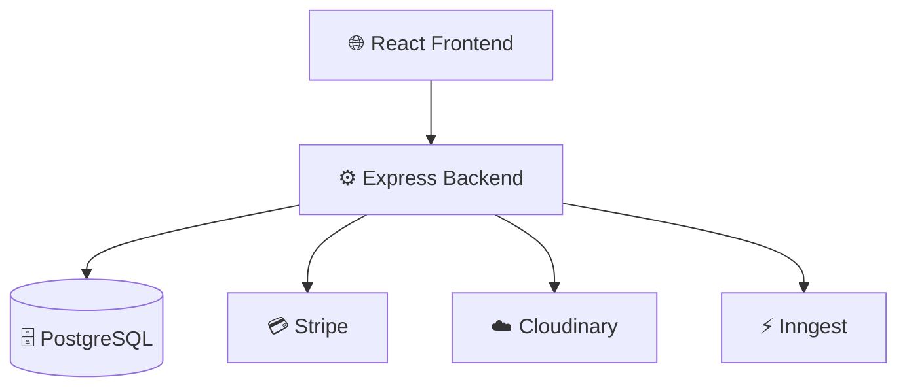

# 🛒 SwiftCart

### 🚀 Modern Grocery Delivery Platform

 

 

---

# 📖 About

SwiftCart is a full-stack grocery delivery platform that enables customers to browse products, place orders, complete online payments, and track deliveries in real time.

The platform includes:

🛍 Customer Portal

👨‍💼 Admin Dashboard

🚚 Delivery Partner Dashboard

💳 Stripe Payments

📍 Live Order Tracking

☁️ Cloudinary Uploads

⚡ Inngest Background Jobs

---

# 📊 Project Statistics

| 📌 Metric | 🚀 Value |
|------------|-----------|
| Frontend Pages | 15+ |
| API Endpoints | 30+ |
| User Roles | 3 |
| Database Tables | 5 |
| Payment Gateway | Stripe |
| ORM | Prisma |
| Storage | Cloudinary |
| Background Jobs | Inngest |

---

# 🛠 Tech Stack

| Frontend | Backend | Database |
|----------|----------|----------|
| ⚛ React 19 | 🟢 Node.js | 🐘 PostgreSQL |
| 🎨 Tailwind CSS | 🚂 Express.js | 🔷 Prisma ORM |
| 📘 TypeScript | 🔐 JWT | ☁ Cloudinary |

# 🏗️ System Architecture

### 🔄 Workflow

1. 👤 User interacts with the React Frontend
2. ⚙️ Frontend communicates with Express APIs
3. 🗄️ Data is stored in PostgreSQL using Prisma ORM
4. 💳 Payments are processed through Stripe
5. ☁️ Product images are uploaded to Cloudinary
6. ⚡ Background jobs run through Inngest

---

# ✨ Features

## 👤 Customer Features

| Feature | Status |
|----------|---------|
| 🔐 Authentication & Authorization | ✅ |
| 🛍️ Product Browsing | ✅ |
| 🔍 Search & Filtering | ✅ |
| 🛒 Shopping Cart | ✅ |
| 📍 Address Management | ✅ |
| 💳 Stripe Payments | ✅ |
| 📦 Order Placement | ✅ |
| 🚚 Live Order Tracking | ✅ |
| 📜 Order History | ✅ |

---

## 👨‍💼 Admin Features

| Feature | Status |
|----------|---------|
| 📊 Dashboard Analytics | ✅ |
| ➕ Add Products | ✅ |
| ✏️ Edit Products | ✅ |
| 🗑️ Delete Products | ✅ |
| 📦 Order Management | ✅ |
| 🚚 Delivery Assignment | ✅ |
| 👥 Manage Delivery Partners | ✅ |
| 📈 System Monitoring | ✅ |

---

## 🚚 Delivery Partner Features

| Feature | Status |
|----------|---------|
| 🔑 Partner Login | ✅ |
| 📦 Assigned Orders | ✅ |
| 📍 Live Location Updates | ✅ |
| 🔄 Delivery Status Updates | ✅ |
| 🔐 OTP Verification | ✅ |
| ✅ Order Completion | ✅ |
| ❌ Delivery Cancellation | ✅ |

---

# 🚀 Tech Stack

| Frontend | Backend | Database | Payments | Storage |
|-----------|----------|----------|----------|----------|
| ⚛️ React 19 | 🟢 Node.js | 🐘 PostgreSQL | 💳 Stripe | ☁️ Cloudinary |
| 🎨 Tailwind CSS | 🚂 Express.js | 🔺 Prisma ORM | 💰 Checkout API | 📸 Image Hosting |
| 🔷 TypeScript | 🔐 JWT Auth | | | |

---

# 📈 Project Statistics

| Category | Details |
|-----------|----------|
| 🖥️ Frontend | React + TypeScript |
| ⚙️ Backend | Express + Node.js |
| 🗄️ Database | PostgreSQL |
| 🔐 Authentication | JWT |
| 💳 Payments | Stripe |
| ☁️ Storage | Cloudinary |
| 🚚 Delivery System | Included |
| 📱 Responsive Design | Yes |
| 🌙 Modern UI | Yes |

---

# ⭐ Star This Repository

If you found this project helpful, please consider giving it a ⭐ on GitHub.

### 🚀 Built with Modern Web Technologies

---

## 👨‍💻 Neeraj Kumar

### Full Stack Developer

💙 React • Node.js • TypeScript • PostgreSQL • Prisma

📧 Contact: neerajkr145518@gmail.com

🌟 Building scalable web applications with modern technologies.

---

### ❤️ Thanks for Visiting

**Happy Coding! 🚀**

